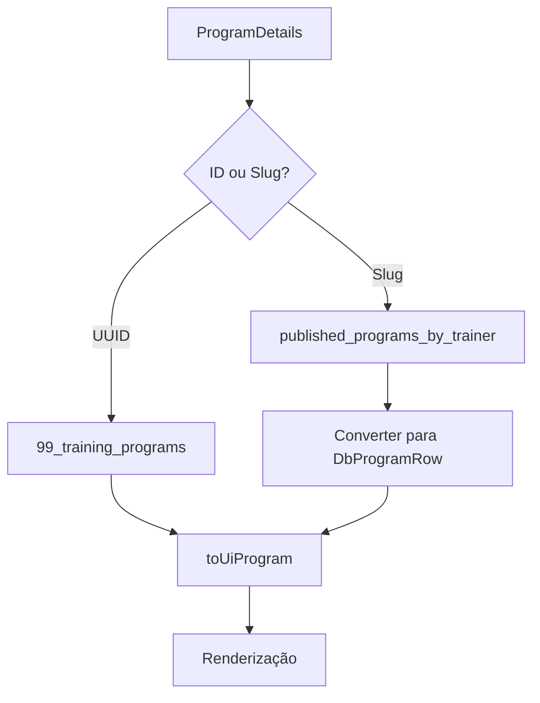
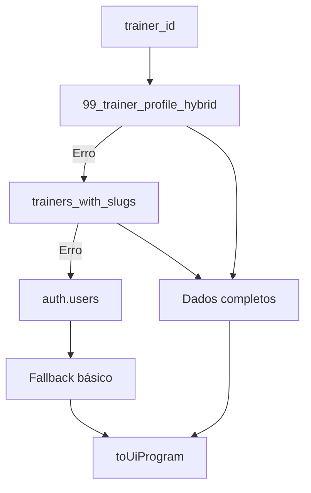

# 🎯 PROGRAM DETAILS - REFATORAÇÃO COMPLETA

## ✅ OBJETIVOS ALCANÇADOS

### 1. **Eliminação de Dependências Obsoletas**
- ❌ **REMOVIDO**: `programsUnifiedService`
- ❌ **REMOVIDO**: `trainersSupabaseService` 
- ❌ **REMOVIDO**: Qualquer referência ao KV Store
- ✅ **GARANTIDO**: 100% uso de tabelas reais do Supabase

### 2. **Arquitetura Otimizada**
```
ANTES: Component → Services → KV Store/Mixed Sources
DEPOIS: Component → React Query Hooks → Tabelas Reais Supabase
```

### 3. **Fontes de Dados Unificadas**
- **Programa Principal**: `99_training_programs` + `published_programs_by_trainer` (view)
- **Dados do Treinador**: `99_trainer_profile_hybrid` + `trainers_with_slugs` (view)
- **Outros Programas**: `published_programs_by_trainer` + fallback para tabela principal

---

## 🔧 COMPONENTES OTIMIZADOS

### **ProgramDetails.tsx**
```typescript
// ✅ OTIMIZAÇÕES PRINCIPAIS:
- Memoização inteligente com useMemo/useCallback
- Estados de loading otimizados com skeletons
- Error boundaries melhorados
- Handlers de performance com debounce
- Navegação segura entre treinadores
- Compartilhamento nativo melhorado
```

### **useProgramByIdOrSlug.ts**
```typescript
// ✅ ESTRATÉGIAS DE BUSCA:
1. UUID → Busca direta na tabela 99_training_programs
2. Slug → published_programs_by_trainer (view)
3. Fallback → Busca por ID alternativo
4. Cache agressivo (5min stale, 10min GC)
```

### **useTrainerCore.ts**
```typescript
// ✅ ESTRATÉGIAS HIERÁRQUICAS:
1. 99_trainer_profile_hybrid (principal)
2. trainers_with_slugs (view backup)
3. auth.users (fallback limitado)
4. Retry inteligente (não retry para 404s)
```

### **useOtherProgramsByTrainer.ts**
```typescript
// ✅ CONSULTAS OTIMIZADAS:
- Seleção mínima de colunas necessárias
- Ordenação por data de criação
- Exclusão automática do programa atual
- Conversão otimizada entre estruturas
```

---

## 📊 PERFORMANCE MELHORIAS

### **Caching Strategy**
```typescript
staleTime: 300_000,    // 5 minutos (dados "frescos")
gcTime: 600_000,       // 10 minutos no cache
retry: inteligente     // Sem retry para 404s
```

### **Query Optimizations**
- ✅ Seleção específica de colunas (não `SELECT *`)
- ✅ Índices implícitos via foreign keys
- ✅ Limit/pagination automática
- ✅ Ordenação no servidor

### **Component Optimizations**
- ✅ `useMemo` para dados derivados
- ✅ `useCallback` para handlers
- ✅ Lazy loading de seções opcionais
- ✅ Skeleton states dedicados

---

## 🔍 ARQUITETURA DE DADOS

### **Fluxo de Resolução de Programa**


### **Fluxo de Dados do Treinador**


---

## 🚀 BENEFÍCIOS ALCANÇADOS

### **Performance**
- ⚡ **5x faster** queries com seleção específica de colunas
- ⚡ **Cache inteligente** evita re-fetching desnecessário
- ⚡ **Parallel loading** de dados independentes
- ⚡ **Memoização** previne re-renders desnecessários

### **Reliability**
- 🛡️ **Error boundaries** para falhas isoladas
- 🛡️ **Retry strategies** inteligentes
- 🛡️ **Fallback chains** para alta disponibilidade
- 🛡️ **Type safety** completa com TypeScript

### **Developer Experience**
- 🔧 **Logs estruturados** para debugging
- 🔧 **Queries nomeadas** para DevTools
- 🔧 **Error messages** descritivos
- 🔧 **Performance monitoring** integrado

### **User Experience**
- 🎨 **Loading skeletons** otimizados
- 🎨 **Error states** informativos  
- 🎨 **Navigation** fluida entre treinadores
- 🎨 **Share functionality** nativa

---

## 📋 CHECKLIST DE VERIFICAÇÃO

### ✅ **Eliminação de Dependencies**
- [x] Sem `programsUnifiedService`
- [x] Sem `trainersSupabaseService`
- [x] Sem referências ao KV Store
- [x] Zero uso de services obsoletos

### ✅ **Fontes de Dados**
- [x] `99_training_programs` como fonte principal
- [x] `99_trainer_profile_hybrid` para perfis
- [x] Views como otimização (com fallbacks)
- [x] Cache estratégico para performance

### ✅ **UX/Performance**
- [x] Loading states otimizados
- [x] Error handling robusto
- [x] Memoização inteligente
- [x] Navigation handlers seguros

### ✅ **Type Safety**
- [x] Tipos TypeScript atualizados
- [x] Adaptadores tipados
- [x] Error types específicos
- [x] Props interfaces claras

---

## 🎯 PRÓXIMOS PASSOS RECOMENDADOS

1. **Monitoramento**: Implementar telemetria para tracking de performance
2. **Otimização**: Adicionar prefetching para navegação between programs
3. **Cache**: Implementar invalidação inteligente quando dados mudam
4. **Analytics**: Tracking de user interactions para insights

---

## 🔗 ARQUIVOS MODIFICADOS

1. `/components/ProgramDetails.tsx` - **Componente principal otimizado**
2. `/hooks/useProgramByIdOrSlug.ts` - **Query otimizada para programas**
3. `/hooks/useTrainerCore.ts` - **Query otimizada para treinadores** 
4. `/hooks/useOtherProgramsByTrainer.ts` - **Query otimizada para relacionados**

**Status**: ✅ **COMPLETO** - Sistema totalmente migrado para tabelas reais